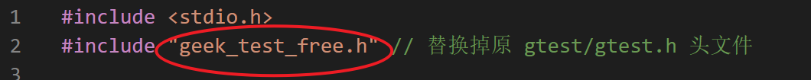

# mini_gtest

```name
              $$\           $$\                    $$\                           $$\     
              \__|          \__|                   $$ |                          $$ |    
$$$$$$\$$$$\  $$\ $$$$$$$\  $$\          $$$$$$\ $$$$$$\    $$$$$$\   $$$$$$$\ $$$$$$\   
$$  _$$  _$$\ $$ |$$  __$$\ $$ |        $$  __$$\\_$$  _|  $$  __$$\ $$  _____|\_$$  _|  
$$ / $$ / $$ |$$ |$$ |  $$ |$$ |        $$ /  $$ | $$ |    $$$$$$$$ |\$$$$$$\    $$ |    
$$ | $$ | $$ |$$ |$$ |  $$ |$$ |        $$ |  $$ | $$ |$$\ $$   ____| \____$$\   $$ |$$\ 
$$ | $$ | $$ |$$ |$$ |  $$ |$$ |        \$$$$$$$ | \$$$$  |\$$$$$$$\ $$$$$$$  |  \$$$$  |
\__| \__| \__|\__|\__|  \__|\__|$$$$$$\  \____$$ |  \____/  \_______|\_______/    \____/ 
                                \______|$$\   $$ |                                       
                                        \$$$$$$  |                                       
                                         \______/                                            
```

C语言100行内仿 [GoogleTest](https://github.com/google/googletest) 测试框架（以及GitHub笔记）

鱼皮视频笔记完整版点[这里](#鱼皮-github-视频的笔记)，如果想要下载，点击右上角绿色的 Code ，再点击 Download ZIP。

- [mini_gtest](#mini_gtest)
  - [mini_gtest 相关](#mini_gtest-相关)
    - [特点](#特点)
    - [上手指南](#上手指南)
      - [安装要求](#安装要求)
        - [操作系统](#操作系统)
        - [软件](#软件)
      - [本地运行](#本地运行)
      - [GitHub运行](#github运行)
    - [源代码](#源代码)
    - [文档](#文档)
  - [仓库建立起因](#仓库建立起因)
  - [鱼皮 GitHub 视频的笔记](#鱼皮-github-视频的笔记)
  - [vscode建立该仓库的过程](#vscode建立该仓库的过程)
  - [在线vscode的使用](#在线vscode的使用)
  - [在线测试](#在线测试)
    - [输入](#输入)
    - [输出](#输出)

## mini_gtest 相关

### 特点

原项目 googletest 名气大（谷歌出品，原仓库 25.7k star），据说工程中也常常用到。

[](https://github.com/youhuangla/mini_gtest/blob/master/img/image-20220508213553533.png)

[google/googletest: GoogleTest - Google Testing and Mocking Framework](https://github.com/google/googletest)

[GoogleTest User’s Guide | GoogleTest](https://google.github.io/googletest/)

我根据课程仿写的这个项目的特点：

1. 依赖较少，对只会 C 语言又想做项目的小白友好。
2. 加深对C/C++中宏的理解。
3. 理解一些软件工程的思想~~也许可以对面试官吹水~~。
4. 数据结构的思想：链表。
5. 如果是一个自己的项目也可以轻易地在最后调用（毕竟很多语言都能调用C语言），让面试官眼前一亮~~装个小b~~，让你的项目锦上添花。ヾ(≧▽≦*)o

所以，如果要 fork 或 star，请 fork 或 star 这个仓库吧，感谢各位大哥的厚爱了(￣▽￣)ノ

### 上手指南

#### 安装要求

##### 操作系统

linux（我用的 Ubuntu）、某些类 Unix 系统（MacOS）理论上可以

##### 软件

C语言编译器: 推荐gcc编译器

即 linux 下的C语言环境，只要能在 linux 下运行C语言，就能运行本项目。

#### 本地运行

只需要将其中一个 `.h` 头文件放到与源 C/C++ 代码同目录下，在代码头部添加 `#include "geek_test_free.h"`，添加测试语句（见[文档](#文档)），编译运行原 C/C++ 程序。可根据我的示例修改。

#### GitHub运行

见[在线测试](##在线测试)

### 源代码

[geek_test_linked_list.h](geek_test_linked_list.h) 

 [gtest_test.cpp](gtest_test.cpp) 

 [geek_test_array.h](geek_test_array.h) 

 [geek_test_color.h](geek_test_color.h) 

 [geek_test_free.h](geek_test_free.h) 

选择以上的  [gtest_test.cpp](gtest_test.cpp) 和其中一个 .h 头文件放在同一个文件夹下即可，虽然命名为 cpp 实际改个后缀就可以用 gcc 编译了。


如果想使用不同的头文件，请将改成对应的头文件名。、

### 文档

[mini_gtest 文档点这里（其实就在文件夹下）](./my_gtest.md)

另外，其实这个 mini 版的 gtest 我自己也没有完全理解透彻。在 valgrind 检查内存泄露后，有一处自动 free 掉我也没搞明白，向各位大佬求教，可以给我提 issue 或 pull request！（pull request说实话我可能还要研究下，没合并过别人的），但是写这个项目还是受益匪浅，估摸着其中的思想还是大致掌握了。如果有疑问也可以提 issue 。


## 仓库建立起因

为什么要单独开源一个 repository （仓库）？

原因：我上次在[5个隐藏的GitHub神技巧，助你秒变大佬！\_哔哩哔哩\_bilibili](https://www.bilibili.com/video/BV1q54y1f7h6?spm_id_from=333.337.search-card.all.click)来自程序员鱼皮的视频中，看完了视频，惊觉十分有用（当年我自己探索的时候被各种环境劝退过）。于是决定记下笔记，当一次“课代表”，所以我就（顺势）开源（复制）了我自己笔记地址：[Note/github\.md at main · youhuangla/Note](https://github.com/youhuangla/Note/blob/main/web/github.md)。

当时原本只是想着给大家做个图文参考，后来 star 的越来越多，竟然还有 fork 的 Σ(ﾟдﾟ；)，属实把我吓到了。由于该仓库是我的（白嫖）github做笔记的仓库，所以里面的笔记良莠不齐，有很多写代码时随意记录的文档，所以被 fork 了感觉挺尴尬的，所以另开一个较小的仓库将鱼皮视频的笔记放进来，毕竟为了单独下载一个小小的 md 文档，属实没必要整个 fork 我那杂乱的笔记（如果要下载，对网速不好的同学来说更是一种煎熬）。

所以在这里将鱼皮视频的笔记加到了这个小仓库里，临时整合了我自己学习，[人人都能学会的编程入门课 (geekbang.org)](https://time.geekbang.org/column/intro/100043901?tab=catalog)的学习笔记。我在胡船长代码的基础上进行了些微的整理与完善，使得代码完成度更高，并可以作为入门实践在github上在线运行，[Gitpod在线运行mini_gtest效果](#gitpod在线运行mini_gtest效果)。如有侵权请联系我删除。

## 鱼皮 GitHub 视频的笔记

同文件夹下的 github_note 中。[传送门](./github_note/github.md)

## vscode建立该仓库的过程

[在同文件的initialised_github_repo中](./initialised_github_repo/initialised_github_repo.md)

比较粗糙，将就看看。具体 git 使用方法推荐阅读《GitHub入门与实践》。

## 在线vscode的使用

可直接看鱼皮视频笔记。


高亮效果：


注意：这种方法仅能阅读，必须要下载后在本地 vscode 才能打开。

## 在线测试

在线运行项目：在项目地址前加上`gitpod.io/#/`前缀

```url
https://gitpod.io/#/github.com/youhuangla/mini_gtest
```

用 github 登陆后


在 TERMINAL 处查看运行环境


### 输入

在 TERMINAL 中输入

```shell
g++ gtest_test.cpp
./a.out
```

### 输出


