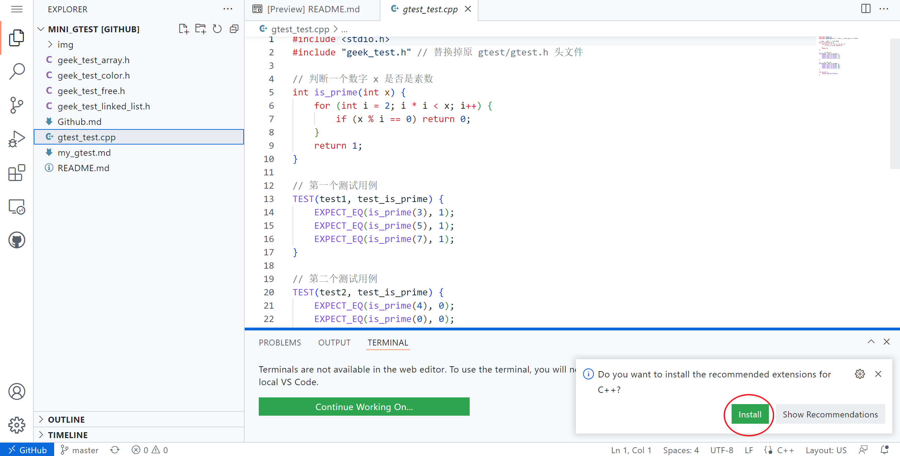
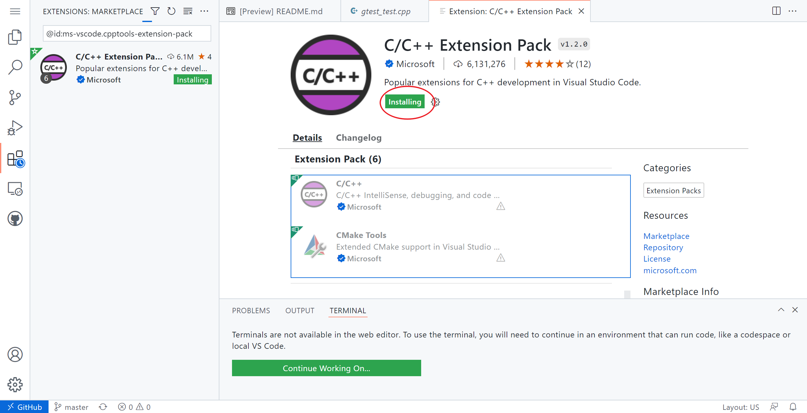
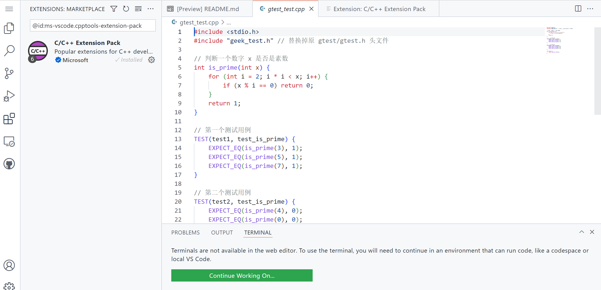
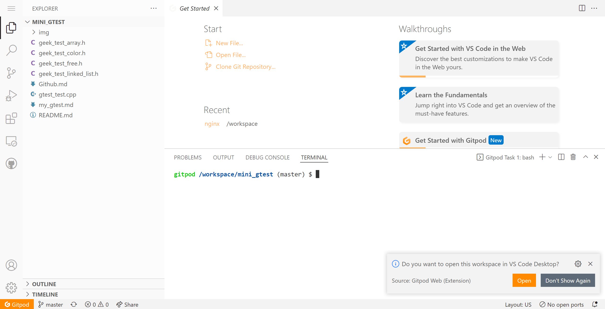
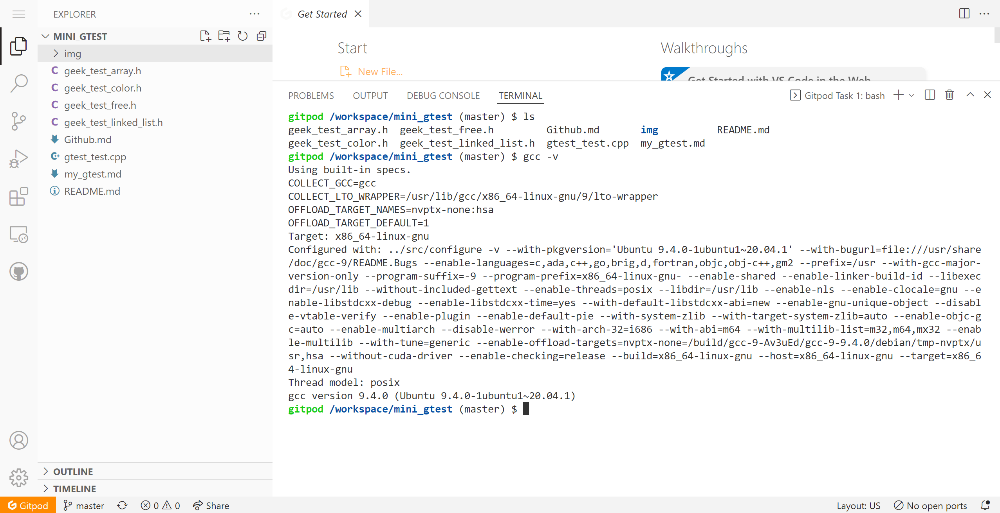
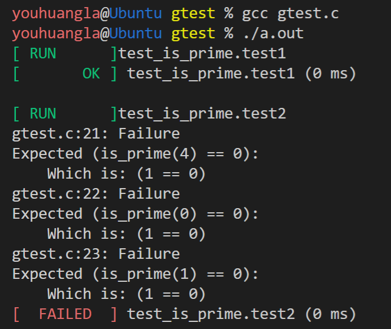

# mini_gtest

## 起因

为什么要单独开源一个 repository （仓库）？

原因：我上次在[5个隐藏的GitHub神技巧，助你秒变大佬！\_哔哩哔哩\_bilibili](https://www.bilibili.com/video/BV1q54y1f7h6?spm_id_from=333.337.search-card.all.click)来自程序员鱼皮的视频中，看完了视频，惊觉十分有用（当年我自己探索的时候被各种环境劝退过）。于是决定记下笔记，当一次“课代表”，所以我就（顺势）开源（复制）了我自己笔记地址：[Note/github\.md at main · youhuangla/Note](https://github.com/youhuangla/Note/blob/main/web/github.md)。

当时原本只是想着给大家做个图文参考，后来 star 的越来越多，竟然还有 fork 的 Σ(ﾟдﾟ；)，属实把我吓到了。由于该仓库是我的（白嫖）github做笔记及的的仓库，所以里面的笔记良莠不齐，有很多写代码时随意记录的文档，所以被 fork 了感觉挺尴尬的，所以另开一个较小的仓库将鱼皮视频的笔记放进来，毕竟为了单独下载一个小小的 md 文档，属实没必要整个 fork 我那杂乱的笔记（对网速不好的同学来说我相信更是一种煎熬）。

所以在这里将鱼皮视频的笔记加到了这个小仓库里，临时整合了我自己学习，[人人都能学会的编程入门课 (geekbang.org)](https://time.geekbang.org/column/intro/100043901?tab=catalog)的学习笔记，并在胡船长代码的基础上进行了些微的整理与完善。如有侵权请联系我删除。

## 在线vscode的使用

可直接看鱼皮视频笔记。





高亮效果：



注意：这种方法仅能阅读，必须要下载后在本地 vscode 才能打开。

## Gitpod在线运行mini_gtest效果

在线运行项目：在项目地址前加上`gitpod.io/#/`前缀

```url
https://gitpod.io/#/github.com/youhuangla/mini_gtest
```

用 github 登陆后



在 TERMINAL 处查看运行环境



### shell 中输入

```shell
g++ gtest_test.cpp
./a.out
```

### 效果


## mini_gtest 相关

### 环境

linux（我用的 Ubuntu）、某些类 Unix 系统（MacOS）理论上可以

gcc编译器

### 源代码

[geek_test_linked_list.h](geek_test_linked_list.h) 

 [gtest_test.cpp](gtest_test.cpp) 

 [geek_test_array.h](geek_test_array.h) 

 [geek_test_color.h](geek_test_color.h) 

 [geek_test_free.h](geek_test_free.h) 

选择以上的  [gtest_test.cpp](gtest_test.cpp) 和其中一个 .h 头文件放在同一个文件夹下即可，虽然命名为 cpp 实际改个后缀就可以用 gcc 编译了。



[mini_gtest 文档点这里（其实就在文件夹下）](./my_gtest.md)

另外，其实这个 mini 版的 gtest 我自己也没有完全理解透彻。在 valgrind 检查内存泄露后，有一处自动 free 掉我也没搞明白。但是其中的大致思想还是掌握了（四分之一？），这个项目很有特点的就是依赖较少，对只会 C 语言又想做项目的小白友好，也能理解一些软件工程的思想~~也许可以对面试官吹水~~。如果是一个自己的项目也可以轻易地在最后调用（毕竟很多语言都能调用C语言），让面试官眼前一亮~~装个小b~~，让你的项目锦上添花。

ヾ(≧▽≦*)o

所以，如果要 fork 或 star，请 fork 或 star 这个仓库吧，感谢各位大哥的厚爱了(￣▽￣)ノ
